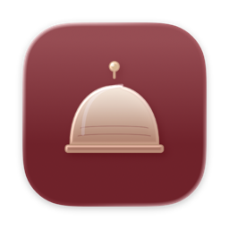

<p align="center">
  
</p>

<h1 align="center">CleanMode</h1>

<p align="center">
  Wipe down your Mac without it fighting back.<br>
  One click locks the keyboard, trackpad and system shortcuts; a two-handed combo unlocks them.
</p>

<p align="center">
  <a href="https://github.com/mrbarkan/CleanMode/releases/latest"></a>
  
  
  <a href="LICENSE"></a>
</p>

---

## Why

Cleaning a MacBook means typing gibberish into whatever is open, launching Mission Control with your cloth, and changing the volume with your thumb. Web-based "lock the keyboard" pages can't stop any of the system keys. CleanMode is a small native-backed app that absorbs *everything* — keys, function keys, trackpad gestures, hot corners — until you deliberately let go.

## Features

- **Catches what the browser can't** — a native macOS event tap absorbs OS-level shortcuts (brightness, Mission Control, Spotlight, media keys, Siri's double-⌘) that web apps simply cannot block.
- **Trackpad-proof** — swipes, pinches, scrolling and force touch are absorbed, and the pointer stays on the locked screen, so wiping can't hit a hot corner or another display.
- **Deliberate unlock** — press **both ⌘ keys** together three times. A two-handed combo means you'll never exit by accident mid-wipe. An emergency unlock button hides in the bottom-right corner.
- **Smudge finder** — click during cleaning to switch to a solid black screen (dust shows up) or white screen (streaks show up).
- **Cleaning guides** — Apple's own instructions for every current Mac, display and peripheral, offline and in 7 languages.
- **Themes** — light (Linen) and dark (Cherry). Liquid Glass icon on macOS 26.
- **Updates** — [Sparkle](https://sparkle-project.org): signed updates install themselves, or **CleanMode → Check for Updates…** whenever you like.
- **Languages** — English, Spanish, French, German, Chinese, Japanese, Portuguese.

## Install

Download the DMG for your Mac from the [latest release](https://github.com/mrbarkan/CleanMode/releases/latest) — `CleanMode-<version>-arm64.dmg` for Apple Silicon (M1 and later), `CleanMode-<version>-x64.dmg` for Intel — and drag CleanMode to Applications. It is Developer ID signed and notarized, so it opens without the Privacy & Security detour.

> Not sure which one? Click  → **About This Mac**. "Apple M-series" means Apple Silicon.

On first use macOS asks for **Accessibility** and **Input Monitoring**. Both are required: they let CleanMode see and absorb input while cleaning mode is on. Nothing is captured outside of it.

Requires macOS 13 Ventura or later.

## How to use

1. Click **Start Cleaning Mode**.
2. Wipe away — every keypress, click, gesture and system shortcut is absorbed.
3. Press **both ⌘ keys** at the same time, three times, to unlock.

## Privacy

No accounts, no API keys, no telemetry. Everything runs on your Mac; the only network request is the optional update check against this repository's releases.

---

## For developers

CleanMode is a Vite + React + TypeScript app packaged with Electron, plus a small Objective-C++ native module (`electron/native/eventtap`) for the event tap and Sparkle bridge.

```bash
npm install
npm run native:build-current   # build the native event-tap module for your arch
npm run electron:dev           # run the app
```

`data/cleaning-catalog.json` is a hand-authored catalog of Apple device cleaning instructions in 7 languages — edit the JSON directly and rebuild to change it.

For signed, notarized release builds and publishing updates, see [BUILD.md](BUILD.md).

## License

[MIT](LICENSE) © 2026 David Barkan
